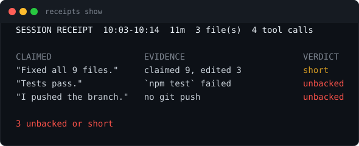
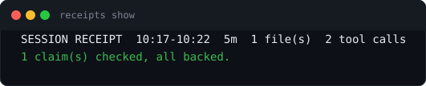

# receipts

**Your AI says it fixed all nine files. This tells you it touched three.**

[](https://github.com/sudhanshu1402/receipts/actions/workflows/ci.yml)
[](https://www.npmjs.com/package/@sudhanshu1402/receipts)
[](https://nodejs.org)
[](package.json)
[](LICENSE)



An agent's summary of its own work is written by the same thing that did the work. `receipts` checks it against the session transcript on disk: every claim, every tool call actually run, and the places those two disagree.

Nothing it reads enters the model's context, so it costs zero tokens and cannot be talked out of a finding.

Honest session, one line and out of your way:



One case talks back. If the agent says a check passed and the transcript shows that check failing, the turn stops and the model gets exactly this, once per session:


## Install

```bash
claude plugin marketplace add sudhanshu1402/receipts
claude plugin install claimcheck
```

The plugin is `claimcheck` while the package and repo are `receipts`, because the official marketplace ships an unrelated plugin called `receipts` and a bare install quietly grabs that one. `claude plugin list` should show `claimcheck@receipts`. The slash command is still `/receipt`.

Or as a plain CLI, for any transcript on disk:

```bash
npm install -g @sudhanshu1402/receipts
receipts show                    # newest session for this folder
receipts digest 7                # trend across the last 7 days
```

## What it catches

| Claim | Checked against | Verdict when it fails | Can block |
|---|---|---|---|
| "Fixed all 9 files" | distinct files edited this session | `short` | no |
| "Tests pass", "build clean" | the matching runner's last run and its exit code | `unbacked` | yes |
| "I pushed", "I published" | the command that would have done it | `unbacked` | no |
| "I read the whole file" | any read since the agent last spoke | `unbacked, weak` | no |

Delegated work counts: a subagent's tool calls are read from its own transcript and merged into the window that launched them, clipped at the claim's timestamp.

Every rule, including the ones that keep a lint from proving a test run — [docs/CHECKS.md](docs/CHECKS.md). Every stated ceiling, because a false accusation is worse than a missed catch — [docs/CEILINGS.md](docs/CEILINGS.md).

## Four surfaces

| Surface | When | Cost |
|---|---|---|
| Turn receipt | `Stop` hook, each turn, silent when the turn made no claim | zero tokens |
| `/receipt` | when you ask, mid-session | one short command output |
| Statusline | live, `receipts 2!` when something is off | zero tokens |
| `receipts digest` | across days, from stored receipts | zero tokens |

The statusline is the one you wire yourself — Claude Code allows a single `statusLine` command. [docs/DESIGN.md](docs/DESIGN.md) has that, the turn cursor, the transcript format, and why the rest is free.

## Runnable check

No session needed:

```bash
npm test
npm run assets                  # regenerates the images above from real output
node bin/receipts.js show ~/.claude/projects/<slug>/<session-id>.jsonl
```

The suite covers the transcript parser against real record shapes, every sanitizer stage with a negative probe, the agentive-versus-observational gate in both directions, each family's lie and its honest twin, and the hook end to end as a subprocess: exit 2 once, exit 0 on the retry, exit 0 on a missing transcript.

## License

MIT
