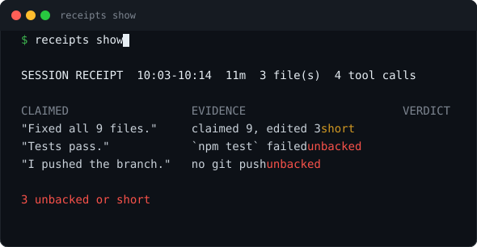
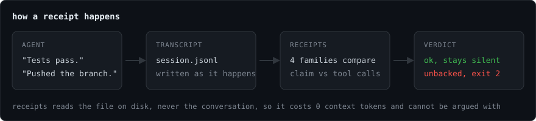

# receipts

**Your AI says it fixed all nine files. This tells you it touched three.**

[](https://github.com/sudhanshu1402/receipts/actions/workflows/ci.yml)
[](https://www.npmjs.com/package/@sudhanshu1402/receipts)
[](https://nodejs.org)
[](package.json)
[](LICENSE)



A Claude Code plugin and CLI that verifies what an AI coding agent claimed against the tool calls in its own session transcript. Catches agent hallucination, false test-pass claims and phantom git pushes, from a `Stop` hook, for zero context tokens.



## Install

```bash
claude plugin marketplace add sudhanshu1402/receipts
claude plugin install claimcheck
```

The plugin is `claimcheck` because the official marketplace already ships an unrelated plugin named `receipts`, and a bare install quietly grabs that one. The slash command is still `/receipt`.

Or as a plain CLI, against any transcript on disk:

```bash
npm install -g @sudhanshu1402/receipts
receipts show                    # newest session for this folder
receipts digest 7                # trend across the last 7 days
```

## Honest turn, one line and gone


## Caught claiming a failed check, the turn stops


Once per session, one line to the model, exit 2.

## What it catches

| Claim | Checked against | Verdict when it fails | Can block |
|---|---|---|---|
| "Fixed all 9 files" | distinct files edited this session | `short` | no |
| "Tests pass", "build clean" | the matching runner's last run and its exit code | `unbacked` | yes |
| "I pushed", "I published" | the command that would have done it | `unbacked` | no |
| "I read the whole file" | any read since the agent last spoke | `unbacked, weak` | no |

Delegated work counts: a subagent's tool calls are read from its own transcript and merged into the window that launched them.

Full rule set in [docs/CHECKS.md](docs/CHECKS.md). What it refuses to judge, because a false accusation is worse than a missed catch, in [docs/CEILINGS.md](docs/CEILINGS.md).

## Four surfaces

| Surface | When | Cost |
|---|---|---|
| Turn receipt | `Stop` hook, each turn, silent when the turn made no claim | zero tokens |
| `/receipt` | when you ask, mid-session | one short command output |
| Statusline | live, `receipts 2!` when something is off | zero tokens |
| `receipts digest` | across days, from stored receipts | zero tokens |

The statusline is the one you wire yourself. [docs/DESIGN.md](docs/DESIGN.md) has that, the turn cursor, the transcript format, and why the rest is free.

## Runnable check

```bash
npm test                        # 140 tests, no session needed
npm run assets                  # regenerates the images above from real output
node bin/receipts.js show ~/.claude/projects/<slug>/<session-id>.jsonl
```

Every terminal image on this page is captured program output, so a change in rendering shows up in the picture. The flow diagram is the one drawing.

## License

MIT
